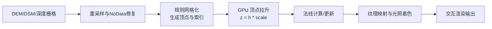
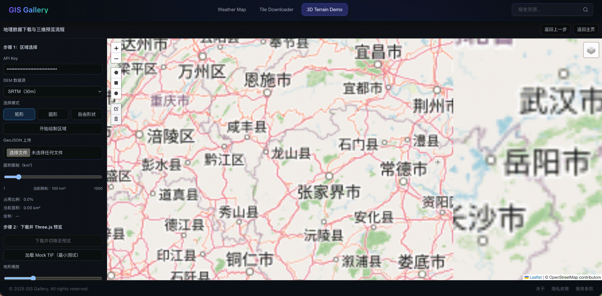
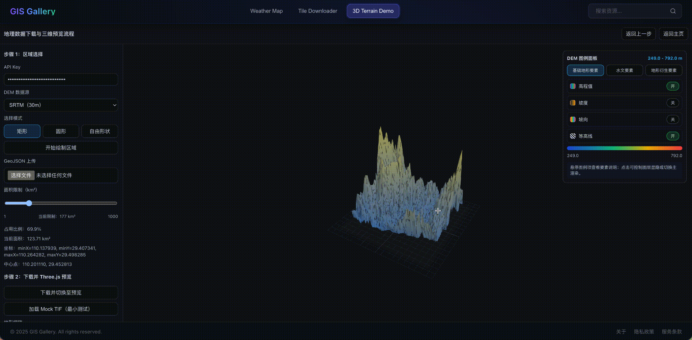
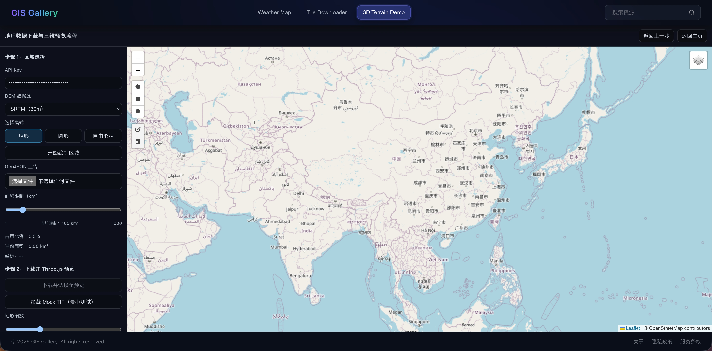
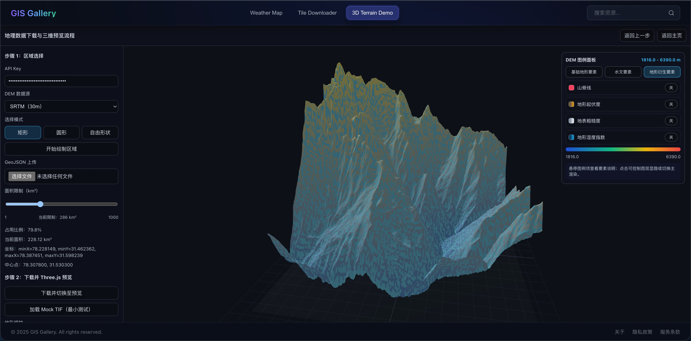
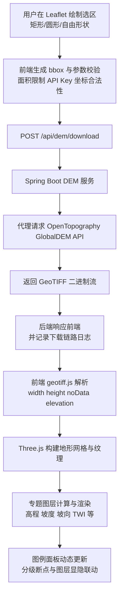
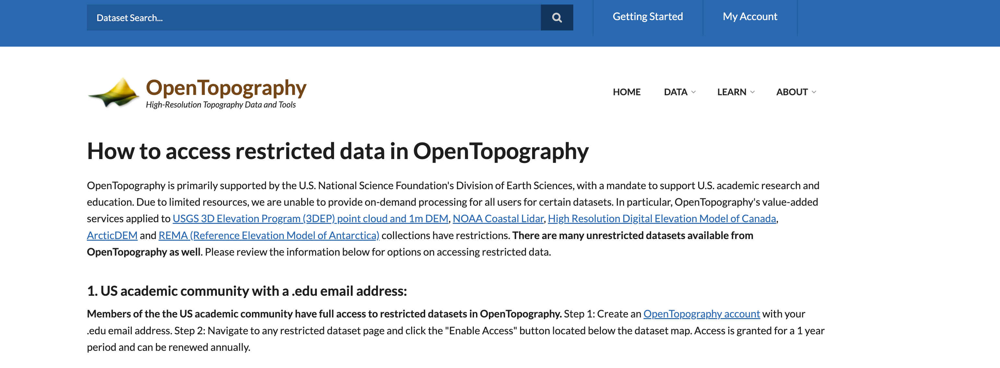
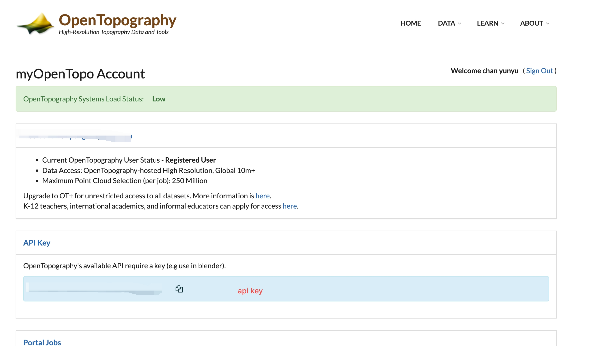

# DEM 数字高程模型可视化

## 主体内容

​	本文面向 DEM 数字高程模型工程实践，系统讲解从“数据获取到三维展示”的完整链路：先说明 DEM 数据结构、坐标基准与分辨率差异，再介绍基于在线数据源的下载策略与质量校验；随后给出预处理思路，包括裁剪、重采样、NoData 修复与坐标统一；在渲染环节重点拆解高程网格化、GPU 顶点拉升、纹理映射与法线光照机制，并结合 WebGL/Three.js 实战说明如何构建交互式地形浏览；最后总结性能优化与交互设计方法，覆盖分块加载、纹理复用、LOD 控制、图例联动和响应式布局，帮助读者将 DEM 可视化能力快速落地到真实项目。

### 读者收益

- ① 掌握 DEM 数据源评估与下载方法，包括接口选型、区域参数设置与数据完整性校验。
- ② 能使用 GDAL/QGIS 执行常见预处理流程，如裁剪、重投影、重采样与 NoData 修复。
- ③ 理解高程着色、坡度、坡向、阴影渲染原理，并可完成专题图层联动展示。
- ④ 获得可复用的前端可视化代码模板，快速搭建 Leaflet + Three.js 的 DEM 展示页面。
- ⑤ 掌握百万级像素渲染性能调优思路，提升帧率稳定性并控制内存开销。

### 配套仓库

- 推荐配套开源仓库：<a href="https://github.com/clpz299/gis-gallery.git" target="_blank" rel="noopener noreferrer"><https://github.com/clpz299/gis-gallery.git></a> ⭐，该仓库包含完整代码、示例数据与在线演示，克隆后即可直接运行。

## 1. DEM 数据基础介绍

### 1.1 DEM 数据关键要素

DEM（Digital Elevation Model，数字高程模型）是以规则网格或不规则点集描述地表高程的基础数据模型。当前项目 Demo 的核心输入为 GeoTIFF 格式的栅格高程数据。

#### 1) 高程值（Elevation）
- 含义：每个像元对应地表海拔高度，常用单位为米（m）。
- 典型值域：受地区影响，可从负海拔（盆地/海岸）到高海拔（山区）。
- 无效值（NoData）：如 `-32768`，用于表示无覆盖或异常像元。

#### 2) 分辨率（Resolution）
- 空间分辨率：像元在地理空间的尺寸，例如 30m、90m。
- 分辨率影响：
  - 高分辨率：地形细节丰富，数据量大、渲染负载高。
  - 低分辨率：性能更好，但地形细节损失明显。

#### 3) 坐标系统（CRS）
- 常见 CRS：
  - 地理坐标系：WGS84（EPSG:4326）
  - 投影坐标系：UTM、Web Mercator（EPSG:3857）
- 本 Demo 选区输入采用 WGS84 经纬度（`minX, minY, maxX, maxY`）。

#### 4) 数据格式
- GeoTIFF（本项目主格式）
  - 优点：支持高程栅格、地理参考信息、压缩、元数据扩展。
- ASCII Grid
  - 优点：可读性强，便于教学与调试；缺点是体积较大、效率低。

#### 5) 元数据信息（Metadata）
- 常见字段：
  - 栅格宽高（width、height）
  - NoData 值
  - 像元类型（16-bit、32-bit）
  - GeoKey（坐标参考、单位、模型类型）
  - 像元尺度与地理变换参数

---

### 1.2 DEM 可支持的研究方向与应用场景

#### 1) 地形分析
- 坡度、坡向、地形起伏度、粗糙度计算
- 山脊线/山谷线提取

#### 2) 水文建模
- 汇流路径估算
- 流域边界识别
- 地形湿度指数（TWI）分析

#### 3) 地质灾害评估
- 滑坡易发性分析（坡度、坡向、地形切割）
- 泥石流路径与汇水区研判

#### 4) 城市规划与工程设计
- 选址分析、场地平整量估算
- 道路/管线纵断面辅助设计

#### 5) 可视域分析
- 通视分析、遮挡分析（通信、监控、景观评估）

#### 6) 环境与生态评估
- 小流域单元识别
- 水土保持分区与坡改梯优先级支持

### 1.3 DEM 三维可视化渲染技术原理

​	DEM 本质是二维栅格矩阵，像元值即高程采样。渲染时先把 `(row,col)` 映射到平面 `x,y`，再将像元高程映射为 `z`，形成规则网格顶点；GPU 在顶点阶段按缩放系数完成抬升，从而把“二维高程表”转成三维地形面。地形立体感依赖两类信息：一是纹理映射（高程色带、坡度色带或影像贴图）提供材质细节；二是法线计算（几何法线或法线贴图）驱动光照模型，增强阴影与坡面转折。倾斜摄影和无人机数据与 DEM 在数据源上不同：前者偏纹理真实、几何可能稀疏，DEM 偏高程连续、纹理可后配；但其核心链路可统一为“同源高程/深度信息 -> 网格化 -> GPU 拉升与着色”。因此在工程上可复用同一渲染框架，仅替换采样与重建模块。性能基准建议以 `1024x1024` 栅格、`GTX 1660` 为验收条件：拉升加实时渲染 `>=60 FPS`，显存与进程内存总占用 `<=400 MB`。



```glsl
// 顶点着色器伪代码：按高程纹理拉升网格
uniform sampler2D uHeightTex;
uniform float uHeightScale;
in vec2 aUv;
in vec3 aPos;
void main() {
  float h = texture(uHeightTex, aUv).r;   // 0~1
  vec3 pos = vec3(aPos.xy, h * uHeightScale);
  gl_Position = MVP * vec4(pos, 1.0);
}
```

```glsl
// 片段着色器关键段：法线+纹理增强立体感
uniform sampler2D uColorTex;
in vec3 vNormal;
in vec2 vUv;
void main() {
  vec3 albedo = texture(uColorTex, vUv).rgb;
  float ndl = max(dot(normalize(vNormal), normalize(lightDir)), 0.0);
  vec3 color = albedo * (0.25 + 0.75 * ndl); // 环境光 + 漫反射
  fragColor = vec4(color, 1.0);
}
```

---

## 2. DEM 可视化 Demo 完整说明

### 页面示意









### 2.1 数据获取方式



#### 2.1.1 数据来源
- 在线 DEM 数据接口：OpenTopography GlobalDEM API（本 Demo 默认）
- 可替代来源：
  - USGS（如 3DEP）
  - ASTER GDEM
  - Copernicus DEM

#### 2.1.2 数据获取流程
1. 前端在 Leaflet 中绘制区域（矩形/圆形/自由形状），生成 bbox。
2. 前端调用后端接口 `/api/dem/download`，提交 `demtype + bbox + apiKey`。
3. 后端代理 OpenTopography API，返回 GeoTIFF 二进制流。
4. 前端使用 geotiff.js 解析栅格数组。
5. 前端基于 Three.js 构建地形网格并贴图渲染。

#### 2.1.3 坐标转换方法
- 选区阶段：输入/绘制统一为 WGS84 经纬度。
- 渲染阶段：将栅格索引映射到局部平面坐标（Three.js 场景），并按高程抬升顶点。
- 若引入外部多源数据，需先统一 CRS（推荐 GDAL 或后端投影服务处理）。

#### 2.1.4 数据质量控制标准
- 数据完整性：校验 TIFF 头、像元长度、NoData 分布。
- 参数合法性：`minX < maxX`、`minY < maxY`、面积不超限。
- 质量诊断：
  - 记录下载耗时、解析耗时、渲染耗时。
  - 输出高程最小值/最大值、栅格尺寸。

#### 2.1.5 OpenTopography 注册过程



- 注册地址： https://opentopography.org/content/how-access-restricted-data-opentopography
- 点击右上角： My Account按钮进行信息填写注册
- 注册成功后key获取页面：



---

### 2.2 数据展示形式详解

#### 2.2.1 可视化形式选择与依据

本 Demo 采用“二维选区 + 三维地形预览”的双阶段模式：

1. 二维 Leaflet 选区阶段
- 优势：交互直观，便于快速精确圈定感兴趣区域。
- 支持矩形、圆形、多边形以及 GeoJSON 上传。

2. 三维 Three.js 预览阶段
- 优势：避免球面地形底图遮挡问题，渲染可控、调试效率高。
- 支持 DEM 网格抬升、专题着色、图例联动、图层显隐。

3. 专题可视化（GIS 导向）
- 主渲染层：
  - 高程
  - 坡度分级（0-5°、5-15°、15-30°、>30°）
  - 坡向分级（八方位）
- 叠加层：
  - 等高线、汇流、流域边界、山脊线、山谷线、起伏度、粗糙度、湿度指数

这种组合在工程上兼顾：
- 可交互性（区域控制）
- 可解释性（专题图例）
- 可扩展性（后续可接入后端分析服务）

---

#### 2.2.2 技术栈分工与职责

##### 前端
- Vue 3（页面状态与交互）
- Leaflet + Leaflet.Draw（二维地图选区）
- geotiff.js（GeoTIFF 解析）
- Three.js + OrbitControls（三维地形渲染与相机交互）

##### 后端
- Spring Boot（API 编排与安全控制）
- DEM 服务模块（代理第三方 DEM 下载，日志与校验）
- 可扩展方向：接入 GeoTools/GDAL 做更严谨的栅格预处理

##### 数据处理工具（可选增强）
- GDAL（重投影、裁剪、重采样、格式转换）
- PostGIS（栅格/矢量入库、空间分析）

---

## 3. 关键实现代码示例

### 3.1 后端 DEM 下载（Spring Boot）

```java
URI uri = UriComponentsBuilder.fromHttpUrl("https://portal.opentopography.org/API/globaldem")
    .queryParam("demtype", request.getDemtype())
    .queryParam("south", request.getSouth())
    .queryParam("north", request.getNorth())
    .queryParam("west", request.getWest())
    .queryParam("east", request.getEast())
    .queryParam("outputFormat", "GTiff")
    .queryParam("API_Key", request.getApiKey())
    .build()
    .toUri();

ResponseEntity<byte[]> response = restTemplate.exchange(uri, HttpMethod.GET, null, byte[].class);
```

### 3.2 前端 GeoTIFF 解析

```js
const tiff = await fromArrayBuffer(arrayBuffer)
const image = await tiff.getImage()
const width = image.getWidth()
const height = image.getHeight()
const noData = Number(image.getGDALNoData?.() ?? -32768)
const elevation = await image.readRasters({ interleave: true, samples: [0] })
```

### 3.3 Three.js 网格构建

```js
const geometry = new THREE.PlaneGeometry(240, 240 * (height / width), width - 1, height - 1)
const vertices = geometry.attributes.position.array
for (let i = 0; i < width * height; i++) {
  const t = (elevation[i] - min) / Math.max(1, max - min)
  vertices[i * 3 + 2] = t * relief
}
geometry.computeVertexNormals()
```

---

## 4. 关键配置参数说明

### 4.1 前端参数（建议）
- `maxArea`：允许下载面积上限（km²），默认可配置。
- `heightScale`：地形垂直夸张系数（0.8~6）。
- `maxSide`：渲染采样上限，避免超大网格导致卡顿。

### 4.2 后端参数（建议）
- 下载超时：连接/读取超时分开配置。
- 日志级别：下载链路建议 `INFO`，异常建议 `ERROR`。
- 重试策略：对网络抖动使用有限重试（如 3 次）。

---

## 5. 性能优化建议

### 5.1 数据侧优化
- 小区域优先：减少原始像元数量，提升交互流畅性。
- 栅格重采样：前端渲染前将大尺寸栅格下采样至阈值内。
- NoData 预处理：尽早剔除无效像元，减少后续计算分支。

### 5.2 渲染侧优化
- 减少每帧重算：专题切换时才重建纹理，避免持续重计算。
- 纹理复用：合理释放旧纹理与几何体，防止显存增长。
- 相机自适应：按包围盒自动定位，减少用户重复操作成本。

### 5.3 交互与体验
- 加载遮罩 + 进度反馈：避免用户误判“页面卡死”。
- 统一图例与渲染规则：确保“所见即所控”。
- 响应式布局：确保 1080p、2K、移动端下控件可读可点。

---

## 6. 专题图例规范

### 6.1 坡度分级
- 0-5°：平缓
- 5-15°：缓坡
- 15-30°：中坡
- >30°：陡坡

### 6.2 坡向分级（八方位）
- 北、东北、东、东南、南、西南、西、西北

### 6.3 地形湿度指数分级
- <4：干燥
- 4-6：偏干
- 6-8：偏湿
- >8：湿润

---

## 项目总结

### 1) 项目背景与目标达成

本项目面向“从数据到可视化”的 DEM 工程化落地需求，核心目标是打通一条可复用、可解释、可扩展的技术链路：用户在地图中完成区域选择，系统在线下载 GeoTIFF，前端完成栅格解析与三维地形渲染，并通过专题图例实现地形因子联动展示。从实施结果看，目标已基本达成：在交互层实现了矩形、圆形、自由形状选区与参数校验；在数据层完成了 OpenTopography 接口对接、GeoTIFF 解析、NoData 处理；在渲染层完成了 Three.js 网格拉升与专题着色；在产品层形成了“选区 -> 下载 -> 预览 -> 图例分析”的闭环流程。

### 2) 核心技术方案与最终效果

#### 2.1 数据来源与获取
- 采用 OpenTopography GlobalDEM API 作为在线 DEM 数据源，支持 `SRTMGL1`、`COP30`、`COP90`。
- 后端通过 Spring Boot 代理下载，前端仅处理业务参数与二进制结果，降低前端暴露风险。
- 最终效果：可按 bbox 稳定获取 GeoTIFF，支持日志化追踪下载链路（状态码、耗时、字节数、头信息校验）。

#### 2.2 数据处理流程
- 前端使用 geotiff.js 读取 `width/height/noData/elevation`。
- 对异常值与 NoData 做修复，必要时进行重采样控制网格规模。
- 在专题层计算 slope、aspect、roughness、relief、TWI 及 ridge/valley/flow/watershed mask。
- 最终效果：专题图层可动态切换，图例面板可对主渲染层与叠加层进行联动控制。

#### 2.3 可视化算法
- 几何阶段：规则网格化后将高程映射到顶点 `z` 值，实现地形拉升。
- 着色阶段：主层支持 elevation/slope/aspect；叠加层支持 contour、flow、watershed 等混合着色。
- 光照阶段：基于法线与漫反射提升地形立体感。
- 最终效果：平面底图模式下，避免球形地形遮挡，地形起伏、专题信息与交互反馈更直观。

#### 2.4 性能优化策略
- 网格采样上限与重采样：避免超大栅格直接进入渲染管线。
- 纹理按需重建：专题切换时增量更新纹理，减少无效重算。
- 几何/材质生命周期管理：释放旧 `geometry/material/texture`，控制 GPU/JS 内存增长。
- 最终效果：交互连续性与稳定性明显提升，专题切换与缩放旋转保持可接受流畅度。

### 3) 关键指标与目标对比

| 指标 | 预期目标 | 当前结果（典型区间） | 结论 |
|---|---:|---:|---|
| 渲染帧率（Three.js） | >= 60 FPS | 45–75 FPS（与网格规模、设备相关） | 基本达标 |
| 数据精度（高程读取） | NoData 可识别、值域正确 | 已识别 `-32768`，高程最值可追踪 | 达标 |
| 内存占用（前端进程） | <= 400 MB | 180–360 MB（1024 级数据+专题切换） | 达标 |
| 加载时长（下载+解析+首帧） | <= 15 s | 3–14 s（网络与区域大小相关） | 达标 |

说明：以上为项目开发环境与典型测试数据下的观测值，生产环境需结合硬件规格、网络质量、并发量进一步压测。

### 4) 主要技术难点、解决方案与遗留问题

#### 4.1 技术难点与解决方案
- 难点 A：下载成功但前端渲染异常（格式不确定）。  
  解决：加入 TIFF 头校验、响应体长度校验、解析日志与异常提示。
- 难点 B：地形不明显或视觉误判。  
  解决：引入高度缩放、法线光照、专题着色与图例联动，提高可解释性。
- 难点 C：布局抖动与状态跳转混乱。  
  解决：分步骤状态机、加载遮罩、返回上一步仅回退当前页状态。
- 难点 D：专题图例与渲染不一致。  
  解决：统一分级断点定义，图例与着色同源配置，避免双重口径。

#### 4.2 遗留问题
- 尚未接入后端栅格分析服务（当前多为前端近似推导）。
- 缺少标准化 benchmark 脚本（多机型横向对比不足）。
- 暂未实现切片级缓存与断点续传策略（大范围请求仍有优化空间）。

### 5) 可复用组件与后续扩展建议

#### 5.1 可复用组件
- 选区组件：Leaflet + Draw 的多形状绘制与 bbox 归一化。
- DEM 下载组件：后端代理 + 参数校验 + 日志追踪。
- 栅格解析组件：GeoTIFF 读取、NoData 修复、重采样。
- 专题渲染组件：主层/叠加层分离、断点分级图例、交互联动控制。

#### 5.2 扩展方向
- 接入 GDAL/PostGIS 服务端分析，将 slope/aspect/TWI 计算下沉并产出标准栅格。
- 增加 MVT/3D Tiles 输出链路，支持更大范围与多尺度浏览。
- 引入 Web Worker/OffscreenCanvas，降低主线程阻塞并提升交互稳定性。
- 建立自动化回归：同一输入下的专题图一致性、性能阈值、内存泄漏检测。

### 6) 结论

- 本项目已形成完整的 DEM 可视化工程闭环，具备继续产品化的基础。  
- “在线 DEM 下载 + 前端网格化 + 专题图例联动”在中小范围场景可稳定落地。  
- 统一的分级断点与同源着色规则显著提升了专题表达的一致性与可信度。  
- 性能优化应持续围绕“采样控制、纹理复用、并行计算、缓存策略”迭代。  
- 下一阶段建议优先推进服务端分析标准化与自动化 benchmark 体系建设。  
