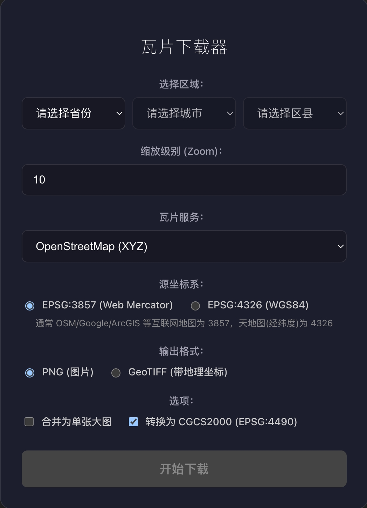
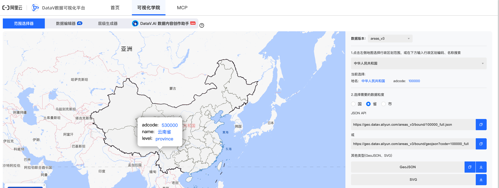
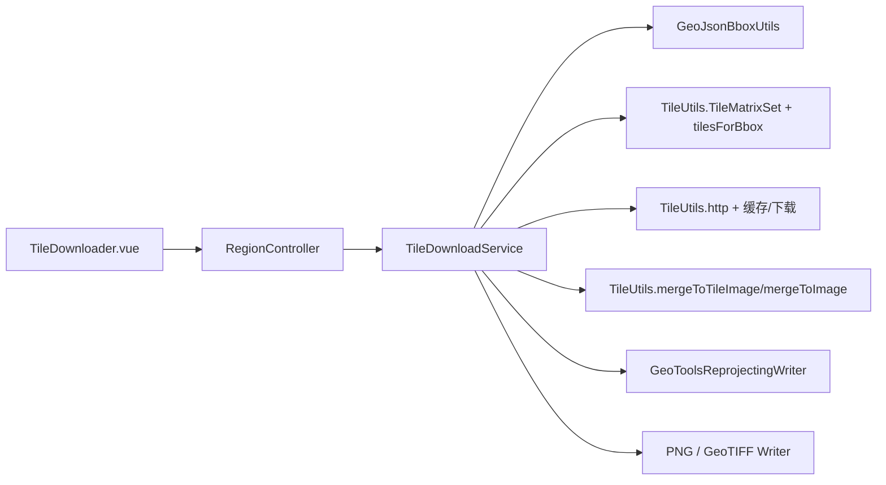

# 区县级瓦片下载与合并（TIF、PNG）

> TL;DR：输入“区县（adcode）+ 瓦片服务（XYZ/WMTS）+ Zoom + 输出格式（PNG/GeoTIFF）”，自动得到可直接使用的离线成果 🗺️📦

本文聚焦一个可落地的工程问题：**给定一个区县边界（GeoJSON），如何确定需要下载哪些瓦片，并最终输出可用的 PNG 或 GeoTIFF（含地理参考）成果**。

这类能力常见于：离线底图制作、项目现场无网应急、专题图快速成图、以及把“在线瓦片服务”沉淀为“本地可控资源”等场景。本文将围绕本仓库现有实现，完整讲清楚从 GeoJSON 到瓦片范围推导、下载、合并、写入坐标参考的全过程，并给出可复现的接口契约与关键代码片段 ✨

**你将获得：**

- 一份可复用的“GeoJSON → BBox → TileRange”算法认知框架 🧠
- 对 Web Mercator / WGS84 / CGCS2000（EPSG:3857/4326/4490）关系的工程化理解 🧭
- 一条可落地的“合并输出 PNG/GeoTIFF”实践路径（可在 QGIS 正确对齐） 🧪

> 说明：本文不修改模块代码；文中所有实现说明以仓库现状为准，避免对未实现能力做额外承诺。

### 页面示意


---

## 2.1 数据来源说明

### 2.1.1 行政区与 GeoJSON 边界

本项目使用的省/市/区行政区划数据与区县边界 GeoJSON 数据来源于 DataV.GeoAtlas 地理小工具（行政区划选择器）：  
- https://datav.aliyun.com/portal/school/atlas/area_selector  
该页面说明其数据源来自高德开放平台，数据版本更新于（仅供学习交流使用）。

**下载步骤（以“北京市海淀区”为例）**：
1. 打开上述页面，搜索“海淀区”或输入 adcode（海淀区：`110108`）
2. 选择输出类型为 GeoJSON
3. 下载得到 `110108.json`（GeoJSON FeatureCollection）

本项目后端实际请求的 GeoJSON 地址模板为：
```text
https://geo.datav.aliyun.com/areas_v3/bound/{adcode}.json
```
例如海淀区：
```text
https://geo.datav.aliyun.com/areas_v3/bound/110108.json
```

### 2.1.2 瓦片服务（XYZ / WMTS）

本文只列出**项目当前内置**的服务选项（来自前端下拉框），并说明其关键属性。  
注意：不同服务的**授权方式、更新频率**可能随时间调整，建议以服务提供方说明为准。

#### XYZ（HTTP URL 模板，典型 256×256 像素瓦片）

| 服务 | 地址模板 | 协议 | 授权方式 | 坐标系/切片矩阵 |
|---|---|---|---|---|
| OpenStreetMap | `https://tile.openstreetmap.org/{z}/{x}/{y}.png` | XYZ | 无（公共服务可能有限流策略） | EPSG:3857（Web Mercator） |
| ArcGIS World Imagery | `https://services.arcgisonline.com/ArcGIS/rest/services/World_Imagery/MapServer/tile/{z}/{y}/{x}` | XYZ | 无（公共服务可能有限流策略） | EPSG:3857（Web Mercator） |
| OpenTopoMap | `https://tile.opentopomap.org/{z}/{x}/{y}.png` | XYZ | 无（公共服务可能有限流策略） | EPSG:3857（Web Mercator） |
| CARTO Light | `https://cartodb-basemaps-a.global.ssl.fastly.net/light_all/{z}/{x}/{y}.png` | XYZ | 无（公共服务可能有限流策略） | EPSG:3857（Web Mercator） |

#### WMTS（OGC WMTS）

| 服务 | 地址模板（项目内置） | 协议 | 授权方式 | 坐标系/切片矩阵 |
|---|---|---|---|---|
| 天地图影像（经纬度） | `http://t0.tianditu.gov.cn/img_c/wmts?...&TILEMATRIXSET=c...&tk=` | WMTS | 需 `tk` | EPSG:4326（经纬度） |
| 天地图影像（Web） | `http://t0.tianditu.gov.cn/img_w/wmts?...&TILEMATRIXSET=w...&tk=` | WMTS | 需 `tk` | EPSG:3857（Web Mercator） |

#### 空间分辨率（与“更新频率”不同，分辨率可计算）

瓦片“空间分辨率”主要由 zoom 决定。以 Web Mercator 为例：  
设地球半径 \(R=6378137\)（单位：米），瓦片尺寸为 256 像素，zoom 为 \(z\)，则：

**公式 (2-1)**：赤道处米/像素（meters per pixel）
\[
\mathrm{mpp}(z) = \frac{2\pi R}{256 \cdot 2^z}
\]

这意味着 zoom 每增加 1 级，分辨率提升 2 倍（米/像素减半）。

---

## 2.2 模块的基本概念

### 2.2.1 四至（BBox）与坐标换算

#### ① BBox 定义
本文的 BBox 使用经纬度外接矩形表达：
```text
minLon, minLat, maxLon, maxLat
```
它表示“能覆盖整个行政区边界的最小矩形范围”。

#### ② WGS84 与 Web Mercator 互转公式

Web Mercator（EPSG:3857）可理解为把经纬度投影到“米”为单位的平面坐标。

设经度 \( \lambda \)（弧度）、纬度 \( \varphi \)（弧度），则：

**公式 (2-2)**：经纬度 → Web Mercator（单位：米）
\[
x = R\lambda
\]
\[
y = R \ln\left(\tan\left(\frac{\pi}{4} + \frac{\varphi}{2}\right)\right)
\]

**公式 (2-3)**：Web Mercator → 经纬度（弧度）
\[
\lambda = \frac{x}{R}
\]
\[
\varphi = 2\arctan(e^{y/R}) - \frac{\pi}{2}
\]

工程实现时通常需要对纬度做裁剪（避免 \(\tan\) 或 \(\ln\) 溢出），常见上限约为 85.05112878°。

#### ③ 度-米-像素：三层换算推导

Web Mercator 这条链路很直观：  
- 度 → 弧度 → 米（公式 2-2）  
- 米 → 像素（公式 2-1 给出 mpp）  
- 像素 → 瓦片（256 像素一片）

下面给出项目中“分辨率”的 Java 推导片段（来自 `GeoTo´olsReprojectingWriter` 的瓦片范围推导逻辑）：

```java
double originShift = 2.0 * Math.PI * 6378137.0 / 2.0;
double resolution = (2.0 * Math.PI * 6378137.0) / (256.0 * (1L << zoom));
```

其中 `resolution` 就是公式 (2-1) 的 \(\mathrm{mpp}(z)\)。

### 2.2.2 XYZ 瓦片编号规则与由 bbox 反算行列号

#### ① XYZ 规则（Web Mercator）
XYZ 瓦片通常使用：
- `z`：缩放级别  
- `x`：从左到右递增  
- `y`：从上到下递增（注意与某些 TMS 方案相反）

#### ② 层级与分辨率对照表（示例）
以公式 (2-1) 为准（赤道处），可得到以下典型值：

| Zoom (z) | m/px（赤道） | 每瓦片覆盖（约，米） |
|---:|---:|---:|
| 0 | 156543.0339 | 40075016.69 |
| 1 | 78271.5169 | 20037508.34 |
| 2 | 39135.7585 | 10018754.17 |
| 3 | 19567.8792 | 5009377.09 |
| 4 | 9783.9396 | 2504688.54 |
| 8 | 611.4962 | 156543.03 |

“每瓦片覆盖” = `m/px * 256`。

#### ③ 由 bbox 反算 tileCol/tileRow（项目实现）

在本项目中，核心逻辑集中在：
- `TileUtils.tilesForBbox(...)`：bbox → 命中的瓦片坐标集合  
- `TileUtils.TileMatrixSet.lonLatToTile(...)`：经纬度 → (x,y,z)  

精简后的核心算法如下（以 `WEB_MERCATOR` 为例）：

```java
int n = 1 << zoom;
int x = (int) Math.floor((lon + 180.0) / 360.0 * n);
double latRad = Math.toRadians(lat);
int y = (int) Math.floor((1.0 - Math.log(Math.tan(latRad) + (1.0 / Math.cos(latRad))) / Math.PI) / 2.0 * n);
```

当 bbox 给出 `minLon/maxLon/minLat/maxLat` 时，项目采用“左上角 + 右下角”转换成瓦片坐标，再取矩形范围：

```java
TileCoord nw = matrixSet.lonLatToTile(bbox.minLon(), bbox.maxLat(), zoom);
TileCoord se = matrixSet.lonLatToTile(bbox.maxLon(), bbox.minLat(), zoom);
```

随后对 (minX..maxX, minY..maxY) 生成瓦片列表（并限制最大数量以避免 OOM）。

> 坐标系识别：下载任务会传入 `sourceEpsg`（EPSG:3857 / EPSG:4326），后端以此选择切片矩阵。对应逻辑见 `TileDownloadService.detectMatrixSet(...)`。

### 2.2.3 TIF / GeoTIFF 结构与本项目支持情况

#### ① TIFF 与 GeoTIFF 简述
- TIFF：一种通用栅格文件容器格式，可存储多种像素类型与压缩方式。  
- GeoTIFF：在 TIFF 基础上，通过一组地理标签（GeoTIFF Tags / GeoKeys）描述影像的坐标参考与空间定位，从而使其能在 GIS 软件中“对齐到正确的位置”。

GeoTIFF 常见关键标签包括：
- ModelPixelScaleTag：像元大小（单位与 CRS 相关）
- ModelTiepointTag：像元与地理坐标的锚点
- GeoKeyDirectoryTag：坐标系统与投影信息（EPSG 等）

#### ② 本项目写出方式与依赖版本

本项目当前通过 GeoTools 写出 GeoTIFF：  
- `GeoTiffTileWriter` 使用 `GridCoverageFactory` + `GeoTiffWriter`  
- 依赖版本：GeoTools `27.2`（见 `pom.xml` 的 `<geotools.version>`）

写出逻辑（精简）：
```java
CoordinateReferenceSystem crs = CRS.decode("EPSG:4326", true);
Envelope2D env = new Envelope2D(crs, minLon, minLat, widthDeg, heightDeg);
GridCoverage2D coverage = factory.create("tiles", image, env);
new GeoTiffWriter(tmp).write(coverage, null);
```

#### ③ BigTIFF / Cloud Optimized GeoTIFF（COG）支持说明
当前代码使用的是标准 `GeoTiffWriter` 直接写出文件，**未显式开启 BigTIFF 或 COG 专项优化参数**。  
如果需要支持更大文件或云原生访问，一般需要：
- 选择 BigTIFF 写出参数（当文件超过 4GB 时）
- COG 需要内部分块（tiling）、概览层（overviews）与排序优化

这些属于扩展方向，本文不做“已支持”的承诺。

---

## 2.3 功能实现与关键代码说明

### 2.3.1 整体架构图



### 2.3.2 数据流程

1) **GeoJSON 解析**  
入口：`TileDownloadService.fetchRegionBBox(adcode)` 通过 URL 拉取 GeoJSON。

2) **BBOX 提取**  
`GeoJsonBboxUtils.extractBBox(InputStream)` 递归遍历 `geometry.coordinates` 计算极值。

3) **瓦片行列计算**  
`TileUtils.tilesForBbox(bbox, zoom, matrixSet)` 根据 `TileMatrixSet` 把 bbox 映射到瓦片矩形范围。

4) **多线程下载**  
合并模式：`TileUtils.mergeToImage(...)` 使用线程池并发下载。  
非合并模式：`downloadAsXyz(...)` 使用并行流批量落盘。

5) **无损合并**  
合并模式：`mergeToImage` 把每张 256×256 瓦片绘制到同一张 `BufferedImage` 画布中。

6) **坐标系写入（GeoTIFF）/ 直接输出（PNG）**  
合并模式：通过 `GeoToolsReprojectingWriter`（可选）后，再由 PNG 或 GeoTIFF writer 输出到文件。

### 2.3.3 核心类精简源码

#### A) GeoJSON → BBox
文件：`src/main/java/com/example/gisgallery/common/util/geojson/GeoJsonBboxUtils.java`

```java
public static TileUtils.BBox extractBBox(JsonNode root) throws IOException {
    if (root.has("bbox")) {
        JsonNode b = root.get("bbox");
        if (b.isArray() && b.size() >= 4) {
            return new TileUtils.BBox(b.get(0).asDouble(), b.get(1).asDouble(), b.get(2).asDouble(), b.get(3).asDouble());
        }
    }
    String type = root.has("type") ? root.get("type").asText() : "";
    if ("FeatureCollection".equalsIgnoreCase(type)) {
        JsonNode features = root.get("features");
        if (features != null && features.isArray()) {
            return calculateBBoxFromFeatures(features);
        }
    }
    throw new IOException("无法从 GeoJSON 中提取或计算有效的 BBox");
}
```

#### B) bbox → tiles（矩形范围）
文件：`src/main/java/com/example/gisgallery/common/util/TileUtils.java`

```java
TileCoord nw = matrixSet.lonLatToTile(bbox.minLon(), bbox.maxLat(), zoom);
TileCoord se = matrixSet.lonLatToTile(bbox.maxLon(), bbox.minLat(), zoom);
int minX = clamp(Math.min(nw.x(), se.x()), 0, width - 1);
int maxX = clamp(Math.max(nw.x(), se.x()), 0, width - 1);
int minY = clamp(Math.min(nw.y(), se.y()), 0, height - 1);
int maxY = clamp(Math.max(nw.y(), se.y()), 0, height - 1);
```

#### C) 下载与合并输出（PNG / GeoTIFF）
文件：`src/main/java/com/example/gisgallery/gridtile/application/service/TileDownloadService.java`

```java
String ext = "tif".equalsIgnoreCase(request.getFormat()) ? "tif" : "png";
TileUtils.TileImageWriter baseWriter =
        "tif".equalsIgnoreCase(request.getFormat()) ? GeoTiffTileWriter.writer() : TileUtils.OutputFormat.PNG.writer();
TileUtils.TileImageWriter writer = new GeoToolsReprojectingWriter(baseWriter, request.getTargetEpsg());
```

### 2.3.4 性能基准

当前代码未内置基准测试类。建议把“单区县、0–8 级”作为一个**可验证的工程目标**，并在本机按以下方式测量：
- 计时：下载任务提交后记录开始/结束时间
- 观察输出文件大小与数量
- 监控 JVM：`jcmd <pid> VM.native_memory summary` 或 IDE profiler

> 公开瓦片服务可能有并发/频率限制，性能结果会受到网络与服务端策略影响。本文不对具体秒数做硬性保证。

---

## 2.4 前端实现哪些内容

### 2.4.1 技术栈与请求封装
- Vue 3 + Vite（项目 `frontend/`）
- Axios：统一请求封装 `frontend/src/utils/request.js`
- API：`frontend/src/api/gridtile.js`

### 2.4.2 当前页面已实现的交互
文件：`frontend/src/components/TileDownloader.vue`

当前页面包含：
- 省/市/区三级联动选择
- 瓦片服务选择（XYZ/WMTS）
- 源坐标系选择（EPSG:3857 / EPSG:4326）
- 输出格式选择（PNG / GeoTIFF）
- 是否合并输出（合并文件 vs z/x/y 目录结构）
- 提交任务后展示 `taskId` 与 `outputPath`

> 当前页面未包含：GeoJSON 地图可视化、bbox 拖拽调整、下载实时进度条、断点续传 UI。这些属于后续可扩展功能，若要实现需要新增后端“任务进度查询/任务取消”等接口与前端轮询/订阅机制。

### 2.4.3 与后端 REST 接口契约（OpenAPI 3.0 片段）

以下片段与当前后端接口一致（`RegionController`）：

```yaml
openapi: 3.0.3
info:
  title: GIS Gallery - GridTile API
  version: 0.1.0
paths:
  /api/gridtile/regions:
    get:
      summary: 获取行政区划树
      responses:
        '200':
          description: OK
          content:
            application/json:
              schema:
                type: object
                properties:
                  code: { type: integer, example: 200 }
                  message: { type: string, example: "success" }
                  data: { type: object }
  /api/gridtile/download:
    post:
      summary: 提交区县瓦片下载任务
      requestBody:
        required: true
        content:
          application/json:
            schema:
              type: object
              required: [adcode, regionName, zoomLevels, serviceUrl, merge]
              properties:
                adcode: { type: integer, example: 110108 }
                regionName: { type: string, example: "北京市海淀区" }
                zoomLevels:
                  type: array
                  items: { type: integer }
                  example: [8]
                serviceUrl:
                  type: string
                  example: "https://tile.openstreetmap.org/{z}/{x}/{y}.png"
                merge: { type: boolean, example: true }
                sourceEpsg: { type: string, example: "EPSG:3857" }
                targetEpsg: { type: string, example: "EPSG:4490" }
                format: { type: string, enum: ["png", "tif"], example: "tif" }
      responses:
        '200':
          description: OK
          content:
            application/json:
              schema:
                type: object
                properties:
                  code: { type: integer, example: 200 }
                  message: { type: string, example: "success" }
                  data:
                    type: object
                    properties:
                      taskId: { type: string }
                      status: { type: string, example: "RUNNING" }
                      outputPath: { type: string }
```

---

## 2.5 总结

- GeoJSON 驱动：通过区县边界 geometry 自动计算 bbox，避免手工框选误差
- 坐标链路明确：源坐标系（3857/4326）→ 瓦片矩阵 → 输出坐标系（4326/4490）
- 合并与非合并两条路径：满足“可视化成图”和“离线切片”两类场景
- GeoTIFF 输出：通过 GeoTools 为合并影像写入地理参考，便于在 QGIS/ArcGIS 中加载


---

## 3. 开箱即用（代码仓库） 🚀

本专栏对应的完整工程已开源，按 README 步骤即可运行（后端一体化打包 / 前后端分离开发均支持）：  

- <a href="https://github.com/clpz299/gis-gallery.git" target="_blank" rel="noopener noreferrer">https://github.com/clpz299/gis-gallery.git</a> ⭐
