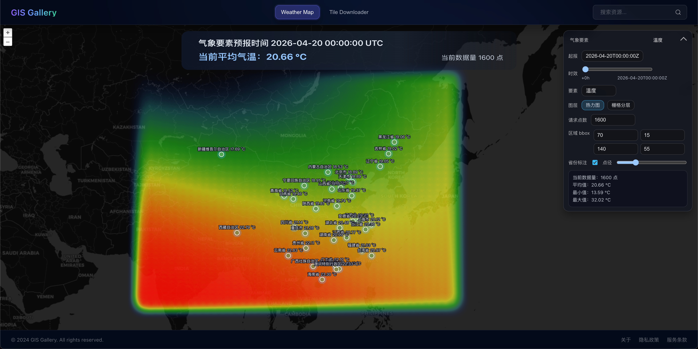
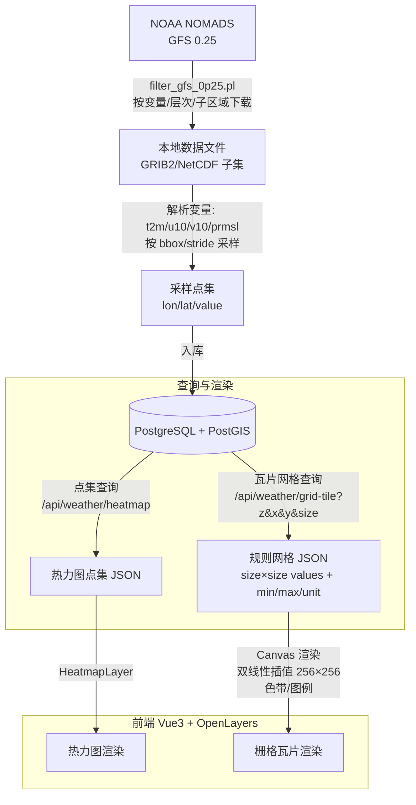
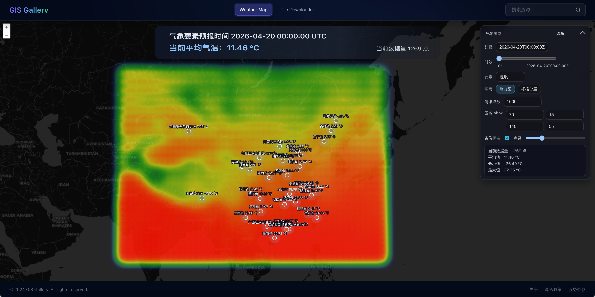
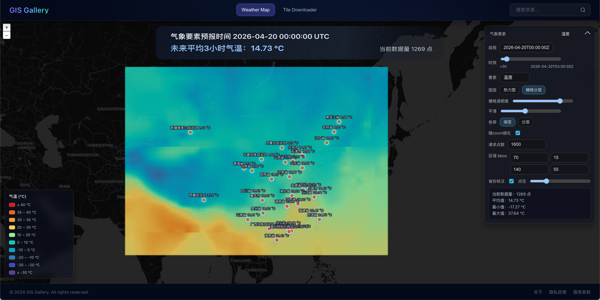

# 气象栅格瓦片渲染与插值设计

​	本文总结本项目中“GFS 气象数据获取 → 服务端栅格瓦片查询 → 前端插值渲染”的整体链路，并重点说明栅格化查询的设计取舍、热力图与栅格瓦片的对比，以及插值算法的实现方式与权衡。

## 0. 项目介绍

​	本项目围绕 NOAA GFS 预报数据构建了一条“获取 → 入库 → 查询 → 地图渲染”的完整链路：后端按要素/起报/时效组织并提供查询接口，前端基于 OpenLayers 支持热力图与栅格瓦片两种可视化方式，并通过分层设色、图例与插值渲染，让气象连续场在缩放/拖拽交互中保持稳定、可理解的表达。

### 0.1 项目定位

- 项目名称：GIS Gallery（气象预报渲染模块）
- 核心能力：按要素/起报/时效渲染气象预报；支持热力图与栅格瓦片两种展示模式；支持分层设色与图例。

### 0.2 技术栈概览

- 后端：Spring Boot + PostgreSQL(PostGIS)
- 前端：Vue3 + OpenLayers
- 数据源：NOAA NOMADS GFS 0.25°

### 0.2.1 前端页面组成

气象渲染页面围绕“地图 + 控制面板 + 图例/弹窗”组织：

- 地图底图：暗色 XYZ 瓦片底图
- 顶部标题（SVG Overlay）：展示起报时间、当前/未来平均值、当前点数量等摘要信息
- 右侧折叠控制面板：统一放置要素/时效/图层/参数等控制项
- 左下角图例（Legend）：随要素变化展示分层设色的颜色与区间
- 地图弹窗（Overlay Popup）：点击省份点位显示该省“最近点”的来源坐标与数值

### 0.2.2 页面核心交互

- 起报时间选择：从 `/api/weather/runs` 获取 run 列表，切换 run 后联动刷新时效列表
- 时效时间轴：从 `/api/weather/forecast-times` 获取 leadHours 列表，用滑块切换预报时效
- 图层切换：热力图 / 栅格分层两种模式一键切换

### 0.2.3 两种渲染模式与接口

1. 热力图（Heatmap）

- 接口：`GET /api/weather/heatmap`
- 返回：点集 `[{lon,lat,value}]` + `unit`
- 前端：将点集转为 Vector Feature，通过 HeatmapLayer 的 `radius/blur/opacity` 渲染

1. 栅格瓦片（Grid Tile）

- 接口：`GET /api/weather/grid-tile?z&x&y&size&model&element&level&runTimeUtc&leadHours`
- 返回：规则网格 `size×size` 的 `values` + `min/max/unit`
- 前端：对每个瓦片拉取 JSON 后，用 Canvas 渲染为图片贴到 TileLayer（并提供色带、图例、透明度控制）

### 0.2.4 栅格渲染参数（页面可调）

在“栅格分层”模式下，页面暴露了与渲染质量相关的关键参数：

- `size`（瓦片网格密度）：16/32/64（越大越细腻，但计算/请求更重）
- `gridOpacity`（栅格透明度）：控制与底图/其他图层的融合
- `gridBlur`（平滑）：对瓦片渲染结果做轻微模糊，减弱块状感与边界突变
- `gridColorMode`（色带模式）：渐变 / 分层（不同要素配有专用色带）
- `gridAutoDetail`（随 zoom 细化）：缩放时自动切换网格密度（近景更细、远景更粗）

### 0.2.5 交互稳定性处理（高频缩放/拖拽）

地图交互会触发大量瓦片请求，页面做了几类稳定性处理，避免“反复缩放/拖拽后不出图或被旧请求覆盖”：

- 刷新节流：对瓦片刷新做合并与延迟触发，减少请求风暴
- 请求取消：单瓦片请求使用 AbortController，新的请求会中止旧请求
- 结果防竞态：仅当返回结果仍对应当前瓦片 src 时才回写 image
- 拖拽结束刷新：监听 `moveend`，拖拽后主动刷新瓦片，保证有请求发出

### 0.3 数据流总览（建议放一张流程图）

建议贴一张“从 GFS 到地图”的流程图，包含：下载 → 解析/采样 → 入库 → 查询 → 前端瓦片渲染。

### 0.4 栅格瓦片渲染效果（建议放 2 张对比图）

建议放两张同一时刻/同一要素的对比截图：

- 热力图（HeatmapLayer）效果截图：展示 zoom 变化下的观感差异
  
- 栅格瓦片（TileLayer + Canvas）效果截图：展示分层设色 + 图例
  

## 1. 实现目标

在 Web 地图上展示气象预报数据（温度、风、气压等），常见做法有两类：

- 点集/热力图渲染：将采样点作为 Vector Feature 推到前端，使用热力图进行视觉表达。
- 栅格瓦片渲染：服务端按 z/x/y 返回瓦片级网格值，前端按瓦片渲染为图像贴图，并配色/插值。

本项目的核心目标是：

- 支持按要素、起报时间、预报时效动态展示；
- 视觉表达尽量“符合直觉”：在缩放/拖拽时效果稳定，避免热力图随 zoom 的视觉误差；
- 将渲染开销控制在“可交互”的范围内。

### 1.1 栅格数据是什么（GIS 视角）

在 GIS 中，数据表达通常分为两大模型：

- 矢量（Vector）：点/线/面与属性，强调边界、拓扑与离散对象（道路、行政区、河流）。
- 栅格（Raster）：把空间划分为规则网格，每个像元（cell/pixel）保存一个值或多个波段，强调连续场或影像（遥感影像、DEM、温度场、气压场）。

栅格数据可以理解为“空间版的矩阵”：

- **空间分辨率（resolution）**：每个像元对应的真实地面大小（或经纬度间隔）。分辨率越高，细节越多，计算与传输成本也越高。
- **空间范围（extent）**：覆盖的地理范围。
- **坐标参考（CRS）**：栅格的坐标体系（例如 WGS84、WebMercator）。同一栅格在不同 CRS 下会发生重投影与重采样。
- **NoData**：缺测/无效值的表达，渲染时通常透明或忽略。
- **连续/离散**：连续栅格（温度/气压）适合插值、等值线与分层设色；离散栅格（土地利用类型）适合分类渲染。

气象要素（温度、风、气压）本质上是一个连续场：它在空间上连续变化，但我们拿到的数值往往来自“规则格点”或“离散采样”。把它当成栅格来处理，符合 GIS 的主流表达方式，也更利于做“图例 + 分层设色 + 空间一致性”的可视化。

### 1.2 为什么要把气象数据按“栅格瓦片”来处理

Web 地图的渲染体系天然是瓦片化（tile-based）的：地图在任意缩放级别上都被切分成大量 z/x/y 的小块，并按视口动态加载。

如果我们直接把气象点集全部推到前端：

- 数据量会随视野扩大快速增长；
- 热力图这种“视觉增强”方法会随 zoom 改变观感，用户容易把“渲染参数变化”误解为“真实值变化”；
- 难以稳定地做分层设色与图例（尤其是希望“每个 zoom 都一致”的颜色表达）。

因此，本项目采用“服务端按瓦片提供规则网格值 + 前端按瓦片渲染”的方式，本质上是把气象要素当作一种“动态栅格底图”：

- 服务端提供更接近 GIS 栅格语义的数据（规则网格 + 单位 + min/max）；
- 前端把网格渲染为图像并做色带、图例与交互；
- 缩放/拖拽时按瓦片加载，性能与交互体验更可控。

### 1.3 GIS 中常见的栅格渲染技术（概览）

工程上，栅格上图主要有几条路线：

- **服务端渲染图片（WMS/WMTS/XYZ PNG）**：服务端直接输出瓦片 PNG/JPEG；前端只负责贴图。优点是前端轻；缺点是样式（色带/阈值/透明度）调整需要服务端参与，交互灵活性较低。
- **服务端输出数值栅格（WCS/自定义网格）+ 前端渲染**：服务端输出可计算的数值（coverage 或规则网格），前端做颜色映射与图例。优点是样式灵活、可做交互式图例；缺点是前端需要 Canvas/WebGL 渲染，且需要处理瓦片拼缝、性能与缓存。
- **COG/GeoTIFF 直读 + 前端 WebGL**：把栅格做成 Cloud Optimized GeoTIFF，通过 Range Request 按需读取，并用 WebGL 渲染。优点是通用、可复用数据资产；缺点是实现复杂，对前端/网络/缓存要求高。
- **派生渲染**：如 DEM 的 hillshade、等值线（contour）、矢量箭头风场、流线等，通常是对栅格做进一步的符号化表达。

本项目选择“自定义数值瓦片 + 前端渲染”的原因是：要素与时效切换频繁，需要快速改色带/阈值/图例，同时希望保留瓦片体系的性能优势。

## 2. 数据获取（GFS）简介

本项目使用 NOAA NOMADS 的 GFS 0.25° 产品，通过 `filter_gfs_0p25.pl` 接口按变量、层次和子区域下载数据：

- 数据源：`https://nomads.ncep.noaa.gov/cgi-bin/filter_gfs_0p25.pl`
- 典型参数：`file`、`dir`、`var_*`、层次（如 `lev_2_m_above_ground`）、`leftlon/rightlon/toplat/bottomlat`

下载结果通常为 GRIB2（或 GRIB2 的子集输出），再由解析模块抽取特定变量（例如 `t2m/u10/v10/prmsl`）并采样为点集写入数据库。

说明：本项目对“气象数据解析过程”保持可用即可，本文不展开解析细节；重点在于“如何让前端以稳定可控的方式渲染”。

## 3. 整体处理流程

链路可以概括为：

1. **下载**：按 run（起报时次）与 lead（时效）拼接 NOMADS URL，下载到本地。
2. **解析/采样**：从 GRIB2/NetCDF 中抽取目标变量，并按 stride/bbox 下采样得到点集。
3. **入库**：将点（lon/lat）与值写入 PostgreSQL（含 PostGIS geom），形成可查询的预报值表。
4. **查询/渲染**：
   - 热力图：前端请求 `/api/weather/heatmap` 得到点集，使用 OpenLayers HeatmapLayer 渲染；
   - 栅格瓦片：前端请求 `/api/weather/grid-tile?z/x/y` 得到规则网格，前端插值成 256×256 图片，并按色带渲染为 TileLayer。

## 4. 栅格化查询设计

### 4.1 为什么做“栅格瓦片查询”

热力图属于“视觉增强”，并不是严格意义的栅格场；它会受到缩放级别、半径/模糊等参数影响，导致用户在不同 zoom 下对“真实空间分布”的直觉被扭曲。

栅格瓦片查询的价值在于：

- 结果与 zoom 的关系更可控：瓦片是地图渲染的天然单位；
- 可以稳定做分层设色（温度/风速/气压等）；
- 可将渲染主逻辑从 Feature/Vector 迁移到 TileLayer（更符合地图渲染模式）。

### 4.2 API 设计

栅格瓦片接口：

- `GET /api/weather/grid-tile`
- 参数：`z, x, y, size, model, element, level, runTimeUtc, leadHours`
- 返回：`size*size` 的规则网格值 `values`（一维数组），并带 `min/max/unit`（用于前端配色/图例）

核心约定：

- `values` 按“行优先”展开：纬度从北到南（j=0 为北），经度从西到东（i=0 为西）。
- `size` 决定瓦片内部网格密度：例如 16/32/64。前端再基于此网格做像素级插值。

### 4.3 查询与裁剪

为了避免“全球瓦片”导致的颜色铺满（例如中国范围外也被渲染出颜色），服务端与前端都做了 bbox 裁剪：

- 服务端：以 `weather.gfs.bbox` 作为业务范围，超出范围返回 `null`（前端渲染为透明）。
- 前端：对 TileLayer 设置 extent（EPSG:3857），减少范围外瓦片的请求与绘制。

### 4.4 计算策略：规则网格中心点采样

对于瓦片 bbox 内的每个网格单元，取该单元中心点（lon/lat），并从 DB 查询得到的点集中插值得到该中心点的数值。

这一步是整个“栅格化查询”的关键：

- 网格过粗：会产生块状感；
- 网格过细：服务端计算开销上升，前端解码/渲染开销也上升；
- 插值策略不当：瓦片边缘或点稀疏区域会出现不自然的断裂/突变。

因此，本项目采用“服务端提供可控密度的规则网格 + 前端像素级插值”的组合：

- 服务端：在 size×size 网格上插值得到较平滑的基础场；
- 前端：将 size×size 网格再双线性插值到 256×256 像素，保证视觉连续。

## 5. 热力图 vs 栅格瓦片（对比）

### 5.1 热力图（HeatmapLayer）

优点：

- 实现快：点集一到即可渲染；
- 交互轻量：适合展示“热点/聚集”类信息；

缺点：

- **受 zoom 影响强**：半径、模糊等参数在不同 zoom 下给人的“真实感”差异大；
- 视觉表达与物理量不严格对应：更像“强度可视化”，不是严格的连续场；

适用：

- 用于快速预览、展示热点；
- 用于点集分布的直观表达（不强调严格数值场）。

### 5.2 栅格瓦片（TileLayer + Canvas）

优点：

- **对 zoom 更稳定**：瓦片渲染符合地图体系；
- 可做分层设色与图例，表达更贴近“数值场”；
- 更适合大范围、持续平移缩放的交互；

缺点：

- 服务端需要做瓦片级计算或缓存；
- 前端需要将 JSON 网格渲染为图片（Canvas）；
- 需要认真处理瓦片边界（拼缝、插值边界效应）。

适用：

- 温度/气压等连续场的可视化；
- 风速/风场的底图渲染（后续可叠加风矢量或流线）。

## 6. 插值算法介绍与工程取舍

插值可以发生在两个位置：

- 服务端：从离散点集得到规则网格值；
- 前端：从规则网格得到像素级图像（256×256）。

### 6.1 前端：双线性插值（Bilinear）

前端拿到 `size×size` 网格后，进行双线性插值将其“拉伸”为 256×256 像素：

- 优点：计算简单、速度快；
- 缺点：本质只是在“规则网格上平滑”，规则网格本身如果块状/不连续，仍会显得不自然；

因此更关键的是：服务端把“规则网格”计算得更合理。

### 6.2 服务端：最近邻（Nearest Neighbor）

最简单的方式：对每个网格中心点取最近一个采样点。

- 优点：速度快、实现简单；
- 缺点：容易形成“泰森多边形”式的块状边界，瓦片之间更容易出现突变；

本项目早期版本使用过该方式，视觉上容易出现“某些瓦片不和谐”。

### 6.3 服务端：IDW（Inverse Distance Weighting）

本项目当前使用 IDW（反距离加权）来生成瓦片网格值：

- 思想：目标点的值是若干邻近点的加权平均，距离越近权重越大；
- 典型形式：`w = 1 / d^p`，p 越大越“贴近最近点”，p 越小越“柔和”；

工程实现要点：

- 取最近 k 个点参与计算（k 过大计算慢，k 过小会噪声/突变）；
- 对瓦片 bbox 做适当扩边查询（否则 tile 边缘缺少邻域点，容易产生边缘突变）；

在“瓦片实时计算”的场景下，IDW 相对克里金更易实现、性能更可控。

### 6.4 克里金（Kriging）简述

克里金在统计意义上更“严谨”，可利用空间相关结构；但工程成本与计算成本更高：

- 通常需要拟合变差函数，并解线性系统；
- 若每个瓦片实时拟合，会非常昂贵；
- 更适合“离线预拟合 + 强缓存 + 局部克里金”。

因此本项目当前选择 IDW 作为更现实的折中。

## 7. 工程化建议与扩展方向

本节从“可维护、可扩展、可发布”的工程角度，给出一些后续优化建议。当前实现已经能支撑交互式展示，但如果要走向更稳定的生产形态，建议在数据管线、缓存与发布能力上进一步完善。

### 7.1 数据下载与任务编排

- 下载器与任务调度解耦：将“定时发现新 run/lead、判重、下载、落盘”做成独立的任务模块，输出可追踪的任务状态（成功/失败/耗时/原因）。
- 引入可重试与断点续传：网络抖动时对下载任务做重试；对于大文件或分片产物，支持续传或按变量拆分下载。
- 任务产物标准化：对每次入库产物落一个元数据（runTimeUtc/leadHours/element/level/bbox/stride/sourceUrl/hash），便于审计与回放。

### 7.2 Python 数据处理链路（清晰化/可复用）

当前 Java 侧可完成解析与采样，但在工程实践里，Python 生态在数值与栅格处理上更成熟，建议把“重型数据处理”下沉到 Python：

- 以 Python 做 ETL：下载后的 GRIB2/NetCDF 由 Python 统一处理（筛变量、重投影、重采样、插值、裁剪）。
- 统一产出栅格数据资产：按要素/时效输出 GeoTIFF/NetCDF/COG，或输出切片（MBTiles/WMTS）。
- 用配置驱动：把元素映射（gfs-var/nc-var/level）与裁剪范围写成配置文件，Python/Java 共用同一份配置，减少漂移。

### 7.3 数据库与索引（面向查询的形态）

目前以点表 + 值表支撑查询，适合灵活的点集/热力图与“即时生成瓦片”。若后续数据量变大，可以考虑：

- 引入分区策略：按 runTimeUtc 或日期分区，减少单表膨胀。
- 预聚合/预切片：对常用要素与 bbox，在入库后预计算部分 zoom/size 的网格或瓦片，降低在线计算成本。
- 缓存层：对 `/api/weather/grid-tile` 做按参数的缓存（内存/磁盘/Redis），减少重复瓦片计算。

### 7.4 栅格图层发布（GeoServer / OGC 标准）

如果目标是提供标准 GIS 服务能力（给桌面 GIS、第三方平台或更多客户端复用），建议引入 GeoServer（或类似栅格服务栈）：

- 发布为 WMS/WMTS：将生成的 GeoTIFF/COG 作为数据源，GeoServer 输出标准地图服务；前端可直接加载 WMTS/WMS。
- 样式统一：在 GeoServer 使用 SLD/Styled Layer Descriptor 统一色带与分级，保证不同客户端一致性。
- 多客户端复用：除 Web 外，QGIS/ArcGIS 等也能直接消费服务；将“渲染能力”从业务前端扩展为平台能力。

### 7.5 更高级的渲染与表达（从栅格到符号化）

在有了稳定栅格底图后，可以进一步增强表达能力：

- 等值线（Contour）：从栅格生成等值线矢量（服务端或前端），用于更“气象图”风格的表达。
- 风场矢量/流线：在栅格风场基础上生成箭头或流线，提供方向信息（当前仅 U/V 分量分层色带）。
- WebGL 加速：如果前端渲染成为瓶颈，可把 Canvas 渲染升级为 WebGL（GPU）渲染，提高连续缩放/动画能力。

### 7.6 插值算法与质量控制

- 参数可配置：将 IDW 的 k/power/扩边 pad 做成配置项或接口参数，便于不同要素/不同密度场做调参。
- 质量评估：引入简单的统计检查（例如值域、异常点比例、NoData 比例、边界突变检测），作为入库后的质量门槛。
- 走向可复制的插值：在对精度要求更高的场景，可逐步评估局部克里金、样条等方法，并配合离线预计算与缓存。
