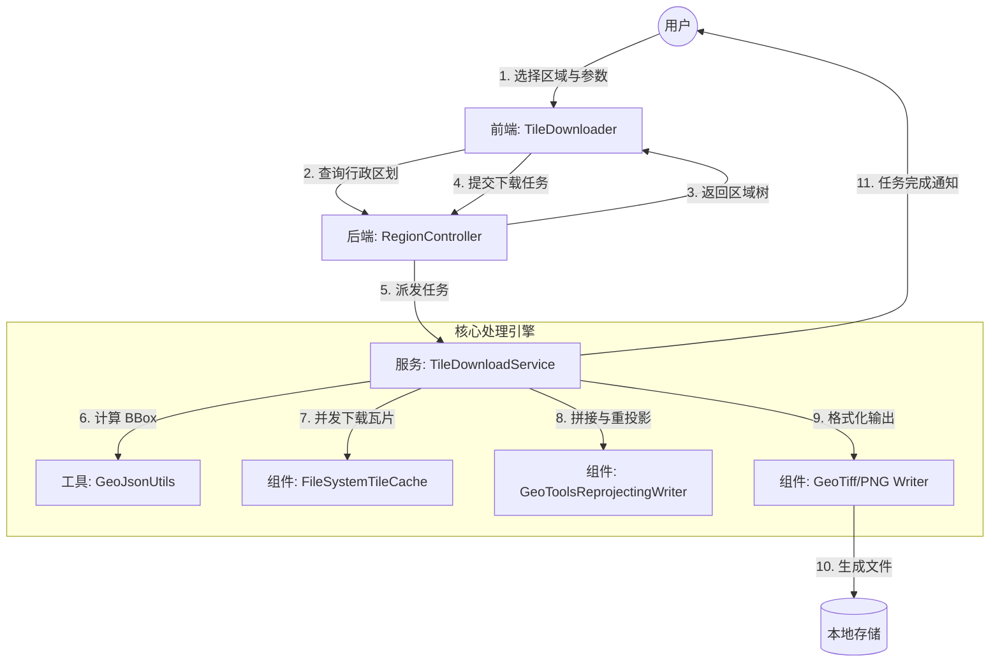

# 区域瓦片下载

> 一句话：选中行政区 → 生成下载任务 → 本地得到 PNG/GeoTIFF 瓦片成果。 🗺️📦

> 数据来源说明：本模块使用的省/市/区行政区划数据与行政区边界 GeoJSON 数据均来源于 <a href="https://datav.aliyun.com/portal/school/atlas/area_selector" target="_blank" rel="noopener noreferrer">DataV.GeoAtlas 地理小工具 - 行政区划选择器</a>（仅供学习交流使用）。在此特别致谢其数据整理与开放共享。🙏

## 这是什么
这是 GIS Gallery 里的“瓦片下载”模块：用户在页面上选择行政区、选择瓦片来源与清晰度，系统自动下载对应区域的地图瓦片，并按需求输出为图片或带地理参考的 GeoTIFF 文件。✨

该模块由两部分共同完成：
- 前端：提供区域选择、参数配置、提交任务与结果展示
- 后端：提供行政区划数据、接收任务并驱动后台下载与处理

## 具有什么能力
- 行政区划选择：省/市/区三级联动，支持直辖市等特殊层级 🧭
- 多数据源选择：可切换不同瓦片服务（如 OSM、ArcGIS、天地图等，注意有些服务需要科学上网方式访问） 🌐
  - 当前内置的 XYZ 服务（Web Mercator / EPSG:3857）：
    - OpenStreetMap（https://tile.openstreetmap.org/{z}/{x}/{y}.png）
    - ArcGIS World Imagery - 影像（https://services.arcgisonline.com/.../tile/{z}/{y}/{x}）
    - OpenTopoMap（https://tile.opentopomap.org/{z}/{x}/{y}.png）
    - CARTO Light（https://cartodb-basemaps-a.global.ssl.fastly.net/light_all/{z}/{x}/{y}.png）
  - 当前内置的 WMTS 服务：
    - 天地图影像（经纬度投影 / EPSG:4326，TILEMATRIXSET=c）
    - 天地图影像（Web Mercator / EPSG:3857，TILEMATRIXSET=w）
- 指定zoom级别下载 🔍
- 输出格式选择 🧾：
  - PNG：便于预览、报告展示
  - GeoTIFF：便于在 GIS 软件中使用（带地理参考信息）
- 坐标系处理（按选项启用）：支持按源坐标系识别与输出目标坐标系选择（如 EPSG:4326 / EPSG:4490） 🧩
- 两种输出形态 📁：
  - 合并输出：生成单个成果文件（PNG 或 GeoTIFF）
  - 不合并输出：保留瓦片目录结构（z/x/y），便于离线切片使用

## 快速上手（30 秒）
1. 选区域（省/市/区）➡️
2. 填 Zoom（如 `10` 或 `10,11`）🔢
3. 选瓦片服务（XYZ/WMTS）🌐
4. 选源坐标系（通常互联网底图为 EPSG:3857）🧭
5. 选输出格式（PNG / GeoTIFF）🧾
6. 选择是否“合并输出”🧩
7. 点击“开始下载”，在返回的输出路径中查看成果 ✅

## 如何操作（用户步骤）
1. 打开“瓦片下载器”页面
2. 选择区域：依次选择省 / 市 / 区县（直辖市会自动适配）
3. 输入缩放级别：例如 `10` 或 `10,11`（最多两级）
4. 选择瓦片服务：从下拉列表中选择一个来源
5. 如服务需要 Key：在页面输入 Key
6. 选择源坐标系：与所选瓦片服务匹配（常见互联网底图为 EPSG:3857）
7. 选择输出格式：PNG 或 GeoTIFF
8. 选择输出方式：是否合并输出
9. 点击“开始下载”，等待系统返回任务信息与输出路径

## 核心价值亮点
- 省事：把“找范围、算瓦片、批量下载、拼接导出”变成一次操作 🚀
- 可控：同一页面统一管理区域、清晰度、数据源与输出格式 🎛️
- 可用：输出既能用于展示（PNG），也能用于 GIS 软件分析（GeoTIFF） 🧪
- 适配：面对不同瓦片服务的坐标系差异，提供明确的选择与处理路径 🧭

## 输出结果在哪里（怎么看）
- 系统会返回任务 ID 与输出路径；成果会生成在该路径下 📌
- 合并输出：会得到一个文件，例如 `区域名_z10.png` 或 `区域名_z10.tif`
- 不合并输出：会得到瓦片目录结构，例如 `tiles/z/x/y.png`

## 小贴士（避免踩坑）
- Zoom 越大越清晰，但下载量会快速增大；建议从较小的 Zoom 先试跑 🧠
- WMTS/XYZ 不同服务的行列号规则可能不同，请优先按“源坐标系”与服务类型选择正确选项 🧭
- OSM 等公开服务会对异常请求返回 “invalid tile”，通常意味着瓦片坐标或范围不匹配 🧩

## 开源许可与社区贡献

1. 本项目全部源代码采用 MIT 开源许可证发布。许可证文件位于项目根目录 `LICENSE`，也可在线查看：<a href="https://github.com/clpz299/gis-gallery/blob/main/LICENSE" target="_blank" rel="noopener noreferrer">MIT License（LICENSE）</a>。
2. GIS 爱好者可基于本项目的可扩展结构，自由二次开发为个人小工具或业务组件，例如：
   - 自定义瓦片源：接入更多 XYZ/WMTS 服务或私有瓦片服务器
   - 新增坐标系支持：扩展更多 EPSG 坐标系与转换链路
   - 集成到现有工具：封装为脚本/命令行工具，或集成到现有 GIS 桌面端工作流中
3. 本项目仅作为技术实现思路与工程化示例，不提供任何商业担保或商业价值承诺；使用者需自行评估风险并对使用结果负责。
4. 统一社区反馈渠道：
   - 提问与问题反馈：<a href="https://github.com/clpz299/gis-gallery/issues" target="_blank" rel="noopener noreferrer">GitHub Issues</a>
   - 贡献代码：<a href="https://github.com/clpz299/gis-gallery/pulls" target="_blank" rel="noopener noreferrer">Pull Requests</a>
   - 讨论与需求建议：<a href="https://github.com/clpz299/gis-gallery/discussions" target="_blank" rel="noopener noreferrer">Discussions</a>
5. 致谢：感谢每一位使用与反馈的 GIS 伙伴。若本项目对您有帮助，欢迎到仓库点个 <a href="https://github.com/clpz299/gis-gallery" target="_blank" rel="noopener noreferrer">Star</a> 支持我们持续维护与完善。⭐

## 协作流程

## 项目界面

